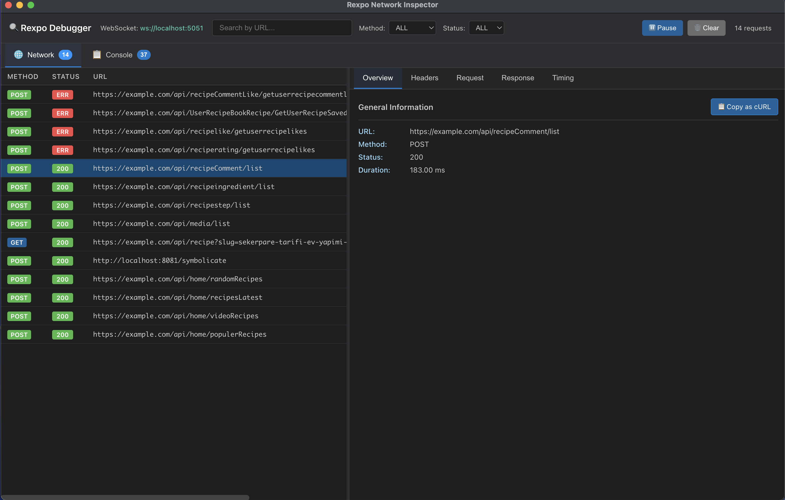

# 🔍 Rexpo Debugger

<div align="center">

[](https://www.npmjs.com/package/rexpo-debugger)
[](https://www.npmjs.com/package/rexpo-debugger)
[](https://opensource.org/licenses/MIT)

</div>

A professional debugging tool similar to **Flipper** and **Chrome DevTools** for your Expo and React Native applications. Monitor network traffic **and** console logs in real-time!



## ✨ Features

### Network Monitoring
- 🚀 **Real-time monitoring**: View all network requests instantly
- 📦 **Fetch & Axios support**: Automatically captures both HTTP clients
- 🔎 **Advanced filtering**: Filter by method, status code, and URL
- 📊 **Detailed analysis**: Headers, request/response body, timing information

### Console Monitoring (NEW! 🎉)
- 📋 **Console logs**: Capture all console.log, warn, error, info, debug calls
- 🎨 **Color-coded levels**: Different colors for each log level
- 🔍 **Stack traces**: Automatic stack trace capture for errors and warnings
- 🎯 **Rich formatting**: Objects, arrays, errors, dates, and more

### General
- 💻 **Cross-platform**: Support for macOS, Windows, and Linux
- 🎨 **Modern UI**: Dark theme with tab navigation
- ⚡ **Lightweight and fast**: Won't slow down your application
- 🔒 **Development only**: Automatically disabled in production

## 🏗️ Architecture

This project consists of two main components:

1. **Desktop Inspector (Electron App)**: Desktop application that visualizes network traffic and console logs
2. **Expo Agents**: Lightweight client agents integrated into your Expo application

```
┌─────────────────────┐         WebSocket          ┌──────────────────────┐
│                     │    (ws://localhost:5051)   │                      │
│  Expo/RN App        │◄───────────────────────────┤  Desktop Inspector   │
│  (Mobile/Emulator)  │                            │  (Electron)          │
│                     │                            │                      │
│  + Network Agent    │                            │  + WebSocket Server  │
│  + Console Agent    │                            │  + React UI          │
│  + fetch override   │                            │  + Tab Navigation    │
│  + console override │                            │                      │
└─────────────────────┘                            └──────────────────────┘
```

## 📦 Installation

### 1. Install the npm package (Recommended)

The easiest way to get started is to install the package from npm:

```bash
# npm
npm install --save-dev rexpo-debugger

# yarn
yarn add -D rexpo-debugger

# pnpm
pnpm add -D rexpo-debugger
```

Then initialize in your Expo app:

```typescript
// App.tsx
import { initNetworkAgent, initConsoleAgent } from "rexpo-debugger";

if (__DEV__) {
  initNetworkAgent({
    wsUrl: "ws://192.168.1.100:5051", // Your computer's IP
    enabled: true,
  });

  initConsoleAgent({
    wsUrl: "ws://192.168.1.100:5051",
    enabled: true,
    captureStackTrace: true,
  });
}
```

> 📦 **npm package**: [rexpo-debugger](https://www.npmjs.com/package/rexpo-debugger)

### 2. Install the Desktop Inspector Application

```bash
# Clone the repository
git clone https://github.com/omeremreelmali/rexpo-debugger.git
cd rexpo-debugger

# Install dependencies
npm install

# Run in development mode
npm run dev

# Or create a production build
npm run build
npm run package
```

### 3. (Alternative) Manual Integration

If you prefer not to use the npm package, copy the agent files to your Expo project:

```bash
# In your Expo project
mkdir -p src/debug
cp -r path/to/expo-agent/src/* src/debug/
```

Initialize the agents in your main file (e.g., `App.tsx`):

```typescript
import { initNetworkAgent, initConsoleAgent } from "./src/debug";

if (__DEV__) {
  // Network monitoring
  initNetworkAgent({
    wsUrl: "ws://YOUR_LOCAL_IP:5051", // Example: ws://192.168.1.100:5051
    enabled: true,
  });

  // Console monitoring (NEW!)
  initConsoleAgent({
    wsUrl: "ws://YOUR_LOCAL_IP:5051", // Same WebSocket connection
    enabled: true,
    captureStackTrace: true, // Capture stack traces for errors/warnings
  });
}
```

> 💡 **Tip**: You can enable one or both agents based on your needs!

### 4. Find Your Local IP Address

**macOS / Linux:**

```bash
ifconfig | grep "inet " | grep -v 127.0.0.1
# or
ipconfig getifaddr en0
```

**Windows:**

```bash
ipconfig
```

Look for an address like `192.168.x.x` or `10.0.x.x` in the output and use it in the `wsUrl`.

## 🚀 Usage

### Start the Desktop Inspector

```bash
npm run dev
```

The application will automatically start a WebSocket server at `ws://localhost:5051`.

### Run Your Expo Application

```bash
cd your-expo-project
npx expo start
```

Open your application on a physical device or emulator. Network requests will automatically start appearing in the inspector!

## 🎨 UI Features

### Tab Navigation

- **Network Tab** 🌐: View all HTTP requests (fetch & axios)
- **Console Tab** 📋: View all console logs

### Network Tab

- **Left Panel**: List of all network requests
  - Method badges (GET, POST, PUT, DELETE, PATCH)
  - Status codes (color-coded: green 2xx, yellow 3xx, orange 4xx, red 5xx)
  - URL, duration, timestamp information
- **Right Panel**: Details of selected request
  - **Overview**: Summary information
  - **Headers**: Request and response headers
  - **Request**: Request body (JSON pretty-print)
  - **Response**: Response body (JSON pretty-print)
  - **Timing**: Timing details

### Console Tab (NEW! 🎉)

- **Left Panel**: List of all console logs
  - Level badges (LOG, INFO, WARN, ERROR, DEBUG)
  - Color-coded by severity
  - Message preview and timestamp
- **Right Panel**: Details of selected log
  - **Message**: All arguments with formatting
  - **Stack Trace**: For errors and warnings
  - **Raw Data**: Full log information

### Filtering and Search

- **Search**: Search by URL (Network) or message (Console)
- **Method Filter**: Show only specific HTTP methods (Network)
- **Status Filter**: Filter by status code (Network)
- **Level Filter**: Filter by log level (Console)
- **Pause**: Temporarily stop capturing new data
- **Clear**: Delete all captured data

## 🔧 Configuration

### Network Agent Options

```typescript
initNetworkAgent({
  // WebSocket URL (required)
  wsUrl: "ws://192.168.1.100:5051",

  // Enable/disable agent (optional, default: true)
  enabled: true,

  // Maximum body snippet length (optional, default: 3000)
  maxBodyLength: 3000,

  // Enable debug logging (optional, default: false)
  debug: false,
});
```

### Console Agent Options

```typescript
initConsoleAgent({
  // WebSocket URL (required)
  wsUrl: "ws://192.168.1.100:5051",

  // Enable/disable agent (optional, default: true)
  enabled: true,

  // Enable debug logging (optional, default: false)
  debug: false,

  // Capture stack traces for errors/warnings (optional, default: true)
  captureStackTrace: true,
});
```

### Environment Variables

In development mode, Electron automatically opens DevTools. To change this:

```typescript
// electron/main.ts
if (
  process.env.NODE_ENV === "development" &&
  process.env.OPEN_DEVTOOLS !== "false"
) {
  mainWindow.webContents.openDevTools();
}
```

## 📁 Project Structure

```
expo-network-inspector/
├── electron/                    # Electron main process
│   ├── main.ts                 # Main process and WebSocket server
│   ├── preload.ts              # Preload script (IPC bridge)
│   └── types.ts                # Shared type definitions
├── renderer/                    # React renderer (UI)
│   ├── components/
│   │   ├── FilterBar.tsx       # Top bar (search, filters)
│   │   ├── NetworkTable.tsx    # Request list
│   │   └── RequestDetails.tsx  # Request details
│   ├── state/
│   │   └── NetworkContext.tsx  # Global state management
│   ├── App.tsx                 # Main React component
│   ├── main.tsx                # React entry point
│   └── types.ts                # Renderer type definitions
├── expo-agent/                  # Expo client agent
│   ├── expoNetworkAgent.ts     # Agent implementation
│   └── README.md               # Agent documentation
├── package.json
├── tsconfig.json               # Renderer TypeScript config
├── tsconfig.electron.json      # Electron TypeScript config
├── vite.config.ts              # Vite config
└── README.md
```

## 🛠️ Development

### Scripts

```bash
# Run in development mode (hot reload)
npm run dev

# Build renderer
npm run build:renderer

# Build electron
npm run build:electron

# Production build (full build)
npm run build

# Create production binary
npm run package

# Type checking
npm run type-check
```

### Build Output

After production build:

- `dist/electron/`: Compiled Electron files
- `dist/renderer/`: Compiled React files
- `release/`: Platform-specific binary files (.dmg, .exe, .AppImage)

## 🐛 Troubleshooting

### "Connection refused" error

✅ **Solutions:**

- Ensure you entered your computer's IP address correctly
- Ensure the inspector application is running
- Ensure your device is on the same WiFi network
- Check your firewall settings

### Requests not showing up

✅ **Solutions:**

- Check for `[NetworkAgent] Connected to inspector` message in console
- Ensure you're in `__DEV__` mode
- Ensure the agent is properly initialized (is `initNetworkAgent` called?)

### Body not visible

⚠️ **Note:** Binary or stream bodies cannot be displayed. The agent only shows text-based bodies.

### Not working on emulator

✅ **Solutions:**

- **Android Emulator**: Use `10.0.2.2` address (host machine's localhost)
- **iOS Simulator**: `localhost` or your computer's IP address should work

## 🚀 Future Features

### Network
- [ ] XMLHttpRequest support
- [ ] WebSocket traffic monitoring
- [ ] GraphQL query/mutation visualization
- [ ] Request replay feature
- [ ] Mock response feature

### Console
- [x] ✅ Console log monitoring (COMPLETED!)
- [ ] Advanced log formatting (React components, etc.)
- [ ] Log export feature

### General
- [ ] Export/Import feature (HAR format for network, JSON for console)
- [ ] Dark/Light theme toggle
- [ ] Automatic reconnect logic
- [ ] Performance metrics
- [ ] Redux/Zustand state monitoring

## 📄 License

MIT

## 🤝 Contributing

Pull requests are welcome! For major changes, please open an issue first to discuss what you would like to change.

See [CONTRIBUTING.md](CONTRIBUTING.md) for detailed guidelines.

## 💡 Inspiration

- [Flipper](https://fbflipper.com/)
- [Chrome DevTools](https://developer.chrome.com/docs/devtools/)
- [React Native Debugger](https://github.com/jhen0409/react-native-debugger)

## 📞 Contact

- **Author**: Ömer Emre Elmalı
- **Email**: omeremreelma@gmail.com
- **GitHub**: [@omeremreelmali](https://github.com/omeremreelmali)

## ⭐ Show Your Support

Give a ⭐️ if this project helped you!

---

**Made with ❤️ for Expo developers**
